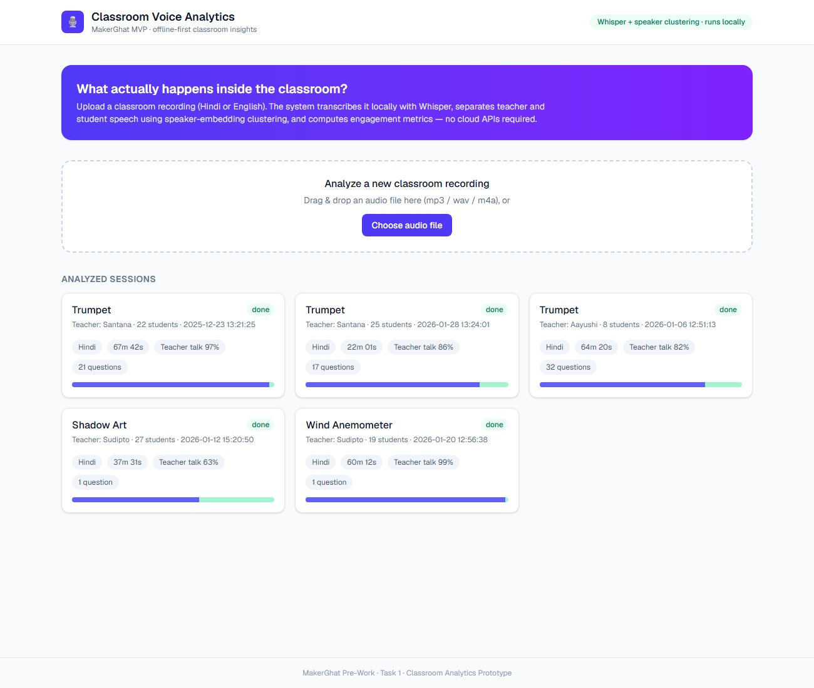
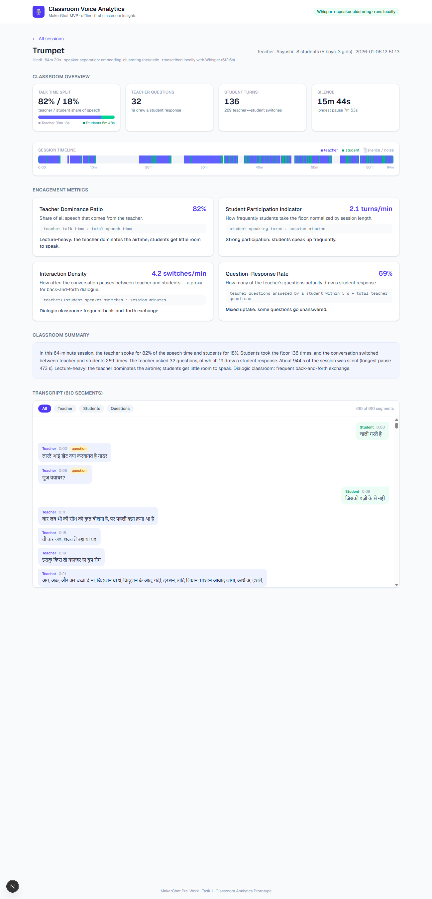

# Classroom Voice Analytics — MVP

MakerGhat Pre-Work · Task 1. An **offline-first** prototype that turns raw classroom audio
(Hindi / English) into insights for teachers and administrators: a transcript, an approximate
teacher-vs-student separation, engagement metrics, and a plain-language classroom summary.





## How it works

```
audio (mp3/wav) ──► faster-whisper (small, int8, CPU)     ──► timestamped transcript + language
                ──► SpeechBrain ECAPA speaker embeddings  ──► 2-cluster teacher/student labels
                ──► rule-based analysis                   ──► talk time, questions, responses, silence
                ──► engagement metrics + template summary ──► JSON result
FastAPI serves the results ──► Next.js + Tailwind dashboard
```

- **Transcription** — [faster-whisper](https://github.com/SYSTRAN/faster-whisper) `small`
  multilingual model, quantized to int8 on CPU. Detects the language automatically (the provided
  recordings come out as Hindi). Everything runs locally; the models are downloaded once and cached.
- **Teacher vs student (approximate)** — each transcript segment is embedded with SpeechBrain's
  ECAPA-TDNN speaker-verification model; embeddings are clustered into 2 groups
  (agglomerative, cosine). The cluster with the larger total talk time is labeled **teacher**.
  Falls back to a duration heuristic for very short recordings.
- **Questions** — a teacher segment counts as a question if it ends with `?` or contains
  interrogative cues in Hindi (क्या, क्यों, कैसे, कौन, कब, कहाँ, कितना, बताओ, समझे …),
  romanized Hindi (kya, kaise, batao …) or English (what, why, how …).
- **Student responses** — a student turn starting within 5 s of the end of a teacher question.
- **Silence** — gaps longer than 2 s between speech segments.

## Engagement metrics

| Metric | Formula | Interpretation |
| --- | --- | --- |
| **Teacher Dominance Ratio** | teacher talk time ÷ total speech time | > 0.8 lecture-heavy · 0.6–0.8 teacher-led but balanced · < 0.6 highly interactive |
| **Student Participation Indicator** | student speaking turns ÷ session minutes | ≥ 1.5/min strong · 0.5–1.5 moderate · < 0.5 low participation |
| **Interaction Density** | teacher↔student speaker switches ÷ session minutes | ≥ 2/min dialogic · 0.8–2 some interaction · < 0.8 monologue-style |
| **Question–Response Rate** | questions answered within 5 s ÷ teacher questions | ≥ 60% questions are landing · 30–60% mixed uptake · < 30% largely unanswered |

Each metric is returned with its formula, explanation, and a plain-language interpretation band,
and is rendered on the session page. The session view also draws a **timeline strip** showing who
holds the floor across the hour — silences and teacher↔student exchanges are visible at a glance.

## Results on the provided recordings

All five recordings were detected as Hindi and processed end-to-end on a laptop CPU
(~6–10 min per hour of audio):

| Session | Activity | Length | Teacher talk | Questions | Answered | Reading |
| --- | --- | --- | --- | --- | --- | --- |
| 2025-12-23 | Trumpet | 68m | 97% | 21 | 4 | lecture-heavy |
| 2026-01-28 | Trumpet | 22m | 86% | 17 | 7 | lecture-heavy |
| 2026-01-06 | Trumpet | 64m | 82% | 32 | 19 | most interactive Q&A |
| 2026-01-12 | Shadow Art | 38m | 63% | 1 | 1 | hands-on, student-driven |
| 2026-01-20 | Wind Anemometer | 60m | 99% | 1 | 0 | demonstration-style |

The spread is encouraging for the concept: activity-based sessions (Shadow Art) show markedly
lower teacher dominance than demonstrations, and questioning style differs sharply between
teachers — exactly the kind of signal administrators currently have no way to see.

## Project layout

```
backend/    FastAPI + analysis pipeline (Python 3.11)
  app/      transcribe.py · diarize.py · analyze.py · pipeline.py · main.py
  scripts/preprocess.py   batch-process the provided recordings
  data/audio/             downloaded classroom recordings (gdown)
  data/results/           one JSON result per session
frontend/   Next.js (App Router) + Tailwind demo UI
```

## Running it

**Backend** (Python 3.11):

```bash
cd backend
python -m venv venv
venv\Scripts\pip install -r requirements.txt --extra-index-url https://download.pytorch.org/whl/cpu

# one-time: download the provided classroom audio + pre-compute results
venv\Scripts\python -m gdown --folder "https://drive.google.com/drive/folders/1_WNSZFva4XPiRHlKxrhpUkrih5MiPk0D" -O data/audio
venv\Scripts\python scripts/preprocess.py

# serve the API
venv\Scripts\python -m uvicorn app.main:app --port 8000
```

**Frontend**:

```bash
cd frontend
npm install
npm run dev     # http://localhost:3000  (proxies /api/* to the backend)
```

The dashboard lists the pre-processed sessions and accepts new uploads; uploads are
transcribed in a background thread and the UI polls until the analysis is ready.

## Honest limitations (it's an MVP)

- Speaker separation is 2-cluster (teacher vs "any student") — individual students are not
  distinguished, and overlapping speech confuses both Whisper and the clustering.
- Question detection is keyword/punctuation-based; rhetorical questions are counted too.
- Whisper `small` gives approximate Hindi transcripts in noisy classrooms; a larger model or
  fine-tuned Indic ASR (e.g. AI4Bharat IndicConformer) would improve accuracy.
- A student response is inferred from timing only, not from whether it answers the question.
